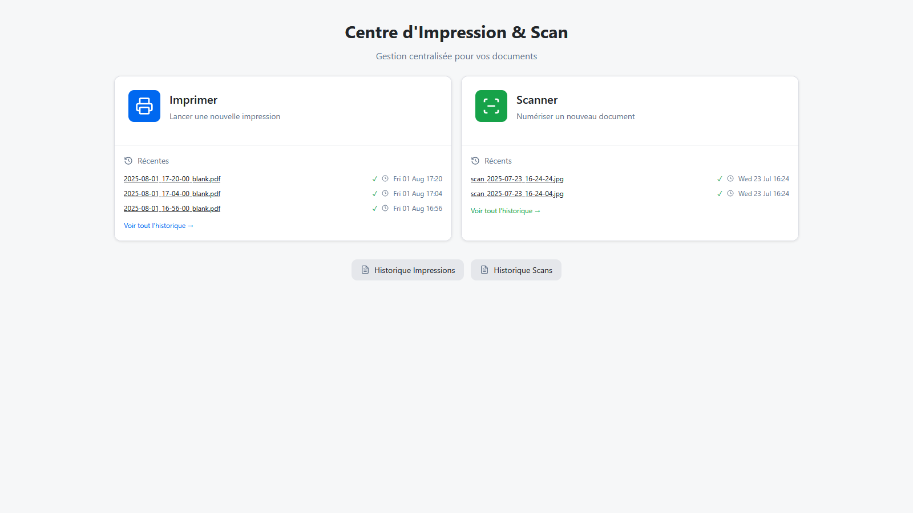

<!-- Improved compatibility of back to top link: See: https://github.com/othneildrew/Best-README-Template/pull/73 -->
<a id="readme-top"></a>

[![Contributors][contributors-shield]][contributors-url]
[![Forks][forks-shield]][forks-url]
[![Stargazers][stars-shield]][stars-url]
[![Issues][issues-shield]][issues-url]
[![MIT License][license-shield]][license-url]


<!-- PROJECT LOGO -->
<br />
<div align="center">
  <!--<a href="https://github.com/Foxelou/WebUSBPrinter">
    
  </a>-->

<h3 align="center">Web USB Printer</h3>

  <p align="center">
    Une interface web locale pour imprimer et numériser facilement des documents PDF à partir d'un navigateur, fonctionnant sur n'importe quel appareil.
    <br />
    <!--<a href="https://github.com/Foxelou/WebUSBPrinter"><strong>Explore the docs »</strong></a>
    <br />-->
    <br />
    <a href="https://github.com/Foxelou/WebUSBPrinter">Voir la démo</a>
    &middot;
    <a href="https://github.com/Foxelou/WebUSBPrinter/issues/new?labels=bug&template=bug-report---.md">Signaler un bug</a>
    &middot;
    <a href="https://github.com/Foxelou/WebUSBPrinter/issues/new?labels=enhancement&template=feature-request---.md">Demander une fonctionnalité</a>
    <br>
    <a href="README-FR.md">README.md en Anglais</a>
  </p>
</div>




<!-- TABLE OF CONTENTS -->
<details>
  <summary>Table des matières</summary>
  <ol>
    <li>
      <a href="#about-the-project">A propos du projet</a>
      <ul>
        <li><a href="#built-with">Languages utilisés</a></li>
      </ul>
    </li>
    <li>
      <a href="#getting-started">Introduction</a>
      <ul>
        <li><a href="#prerequisites">Prérequis</a></li>
        <li><a href="#installation">Installation</a></li>
      </ul>
    </li>
    <li><a href="#usage">Utilisation</a></li>
    <!--<li><a href="#roadmap">Roadmap</a></li>-->
    <li><a href="#contributing">Contribution</a></li>
    <li><a href="#license">Licence</a></li>
    <li><a href="#contact">Contact</a></li>
    <li><a href="#acknowledgments">Remerciements</a></li>
  </ol>
</details>


<!-- ABOUT THE PROJECT -->
## A propos du projet

Ce tableau de bord permet aux utilisateurs de :
- Imprimer des documents directement à partir de l'interface web
- Numériser et télécharger des documents
- Visualiser les impressions et numérisations récentes

Il est optimisé pour les **tablettes**, **smartphones** et **ordinateurs de bureau**, avec un design qui fonctionne comme une **application web** : défilement minimal, mise en page réactive.

<p align="right">(<a href="#readme-top">back to top</a>)</p>


### Languages utilisés


* [![PHP][php.net]][PHP-url]
* [![HTML][html]][HTML-url]
* [![CSS][CSS]][CSS-url]
* [![PowerShell][Powershell]][Powershell-url]

<p align="right">(<a href="#readme-top">back to top</a>)</p>


<!-- GETTING STARTED -->
## Introduction

Suivez les étapes suivantes pour installer et exécuter l'interface web permettant d'imprimer et de numériser facilement des documents PDF dans un environnement local (WAMP) :

### Prérequis

* [Wampserver](https://www.wampserver.com/)
* [Wampserver - Files and addons](https://wampserver.aviatechno.net/) (Download Microsoft VC++ x86 and x64 packages)
  * [All VC++ Redistributable Packages x86 x64 (direct download link)](https://wampserver.aviatechno.net/files/vcpackages/all_vc_redist_x86_x64.zip)
  * [Checking installed VC++ packages  (direct download link)](https://wampserver.aviatechno.net/files/tools/check_vcredist.exe)
### Installation

1. Installer les paquets Microsoft VC++ x86 et x64 et Wampserver
2. Clonez le repo dans votre dossier /www/. (C:\wamp64\www\ sous Windows) 
   ```sh
   git clone https://github.com/Foxelou/WebUSBPrinter.git
   ```
3. Modifiez le fichier de configuration config.php comme vous le souhaitez
4. Changez l'url de git remote pour éviter les pushs accidentels vers le projet de base
   ```sh
   git remote set-url origin github_username/repo_name
   git remote -v # confirmez les changements
   ```
   ⚠️ A ce stade, le site n'est accessible qu'à partir de votre machine. Il n'est pas encore accessible aux autres appareils de votre réseau local.

5. Créez un Serveur Virtuel pour l'accès au réseau local

    Ouvrez C:\wamp64\bin\apache\apache2.x.x\conf\extra\httpd-vhosts.conf

    Copiez et collez cette configuration :
    ```conf
    # Virtual Hosts
    #
    <VirtualHost *:80>
    ServerName localhost
    ServerAlias localhost
    DocumentRoot "${INSTALL_DIR}/www"
    <Directory "${INSTALL_DIR}/www/">
        Options +Indexes +Includes +FollowSymLinks +MultiViews
        AllowOverride All
        Require all granted
    </Directory>
    </VirtualHost>
    ```
6. Autoriser les connexions réseau dans Apache

    Ouvrez C:\wamp64\bin\apache\apache2.x.x\conf\httpd.conf

    Vérifiez que les lignes suivantes sont présentes et non commentées (# avant Listen) :
    ```
    Listen 0.0.0.0:80
    Listen [::0]:80
    ```

    Et remplacez `ServerName localhost:80` par votre adresse ip locale (exemple : `ServerName 192.168.1.2:80`)
6. Redémarrez le serveur WAMP

<p align="right">(<a href="#readme-top">back to top</a>)</p>


<!-- USAGE EXAMPLES -->
## Utilisation

* Accédez au tableau de bord via http://localhost/WebUSBPrinter
* Utilisez le menu pour :
  * Charger et imprimer des fichiers PDF
  * Déclencher une numérisation et télécharger l'image


<!-- _For more examples, please refer to the [Documentation](https://example.com)_-->

<p align="right">(<a href="#readme-top">back to top</a>)</p>


<!-- ROADMAP
## Roadmap

- [ ] Feature 1
- [ ] Feature 2
- [ ] Feature 3
    - [ ] Nested Feature

See the [open issues](https://github.com/Foxelou/WebUSBPrinter/issues) for a full list of proposed features (and known issues).

<p align="right">(<a href="#readme-top">back to top</a>)</p>  -->


<!-- CONTRIBUTING -->
## Contribution

Les contributions sont ce qui fait de la communauté open source un endroit extraordinaire pour apprendre, inspirer et créer. Toutes vos contributions sont **très appréciées**.

Si vous avez une suggestion qui permettrait d'améliorer ce projet, merci de forker le repo et de créer une pull request. Vous pouvez aussi simplement ouvrir un problème avec le tag "enhancement".
N'oubliez pas de donner une étoile au projet ! Merci à tous !

1. Forker le projet
2. Créez votre branche de développement (`git checkout -b feature/AmazingFeature`)
3. Committez vos modifications (`git commit -m “Add some AmazingFeature”`)
4. Poussez vers la branche (`git push origin feature/AmazingFeature`)
5. Ouvrir une Pull Request

<p align="right">(<a href="#readme-top">back to top</a>)</p>

<!-- ### Top contributors:

<a href="https://github.com/Foxelou/WebUSBPrinter/graphs/contributors">
  
</a> -->


<!-- LICENSE -->
## Licence

Distribué sous la licence MIT. Voir [LICENCE](license-url) pour plus d'informations.

<p align="right">(<a href="#readme-top">back to top</a>)</p>


<!-- CONTACT -->
## Contact

Portfolio : https://elouanbret.alwaysdata.net/

Lien du projet : [https://github.com/Foxelou/WebUSBPrinter](https://github.com/Foxelou/WebUSBPrinter)

<p align="right">(<a href="#readme-top">back to top</a>)</p>


<!-- ACKNOWLEDGMENTS -->
## Remerciements

* [Wampserver](https://www.wampserver.com/)
* [Wampserver - Files and addons](https://wampserver.aviatechno.net/) (Téléchargement des packages Microsoft VC++ x86 et x64)
* [Sumatra PDF](https://www.sumatrapdfreader.org/free-pdf-reader)
* [Sumatra PDF - Command line arguments](https://www.sumatrapdfreader.org/docs/Command-line-arguments)

<p align="right">(<a href="#readme-top">back to top</a>)</p>


<!-- MARKDOWN LINKS & IMAGES -->
<!-- https://www.markdownguide.org/basic-syntax/#reference-style-links -->
[contributors-shield]: https://img.shields.io/github/contributors/Foxelou/WebUSBPrinter.svg?style=for-the-badge
[contributors-url]: https://github.com/Foxelou/WebUSBPrinter/graphs/contributors
[forks-shield]: https://img.shields.io/github/forks/Foxelou/WebUSBPrinter.svg?style=for-the-badge
[forks-url]: https://github.com/Foxelou/WebUSBPrinter/network/members
[stars-shield]: https://img.shields.io/github/stars/Foxelou/WebUSBPrinter.svg?style=for-the-badge
[stars-url]: https://github.com/Foxelou/WebUSBPrinter/stargazers
[issues-shield]: https://img.shields.io/github/issues/Foxelou/WebUSBPrinter.svg?style=for-the-badge
[issues-url]: https://github.com/Foxelou/WebUSBPrinter/issues
[license-shield]: https://img.shields.io/github/license/Foxelou/WebUSBPrinter.svg?style=for-the-badge
[license-url]: https://github.com/Foxelou/WebUSBPrinter/blob/master/LICENSE-FR


[Bootstrap.com]: https://img.shields.io/badge/Bootstrap-563D7C?style=for-the-badge&logo=bootstrap&logoColor=white
[Bootstrap-url]: https://getbootstrap.com

[php.net]: https://img.shields.io/badge/PHP-4f5b93?style=for-the-badge&logo=php&logoColor=white
[PHP-url]: https://www.php.net/

[html]: https://img.shields.io/badge/HTML5-f06529?style=for-the-badge&logo=html5&logoColor=white
[html-url]: https://developer.mozilla.org/en-US/docs/Web/HTML

[css]: https://img.shields.io/badge/CSS3-2965f1?style=for-the-badge&logo=css&logoColor=white
[css-url]: https://developer.mozilla.org/en-US/docs/Web/CSS

[powershell]: https://img.shields.io/badge/Powershell-1b9cf2?style=for-the-badge&logo=Powershell&logoColor=white
[powershell-url]: https://learn.microsoft.com/en-us/powershell/scripting/overview?view=powershell-7.5